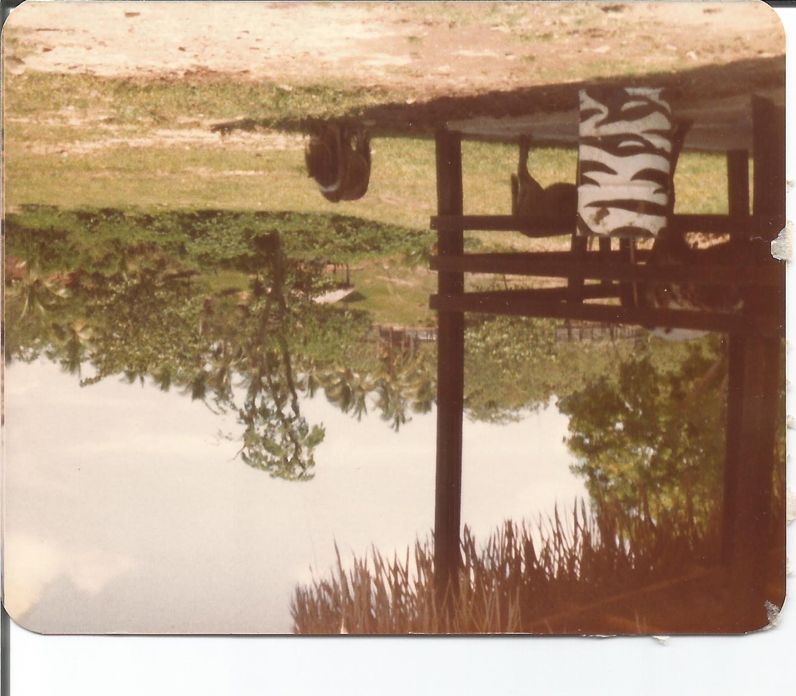
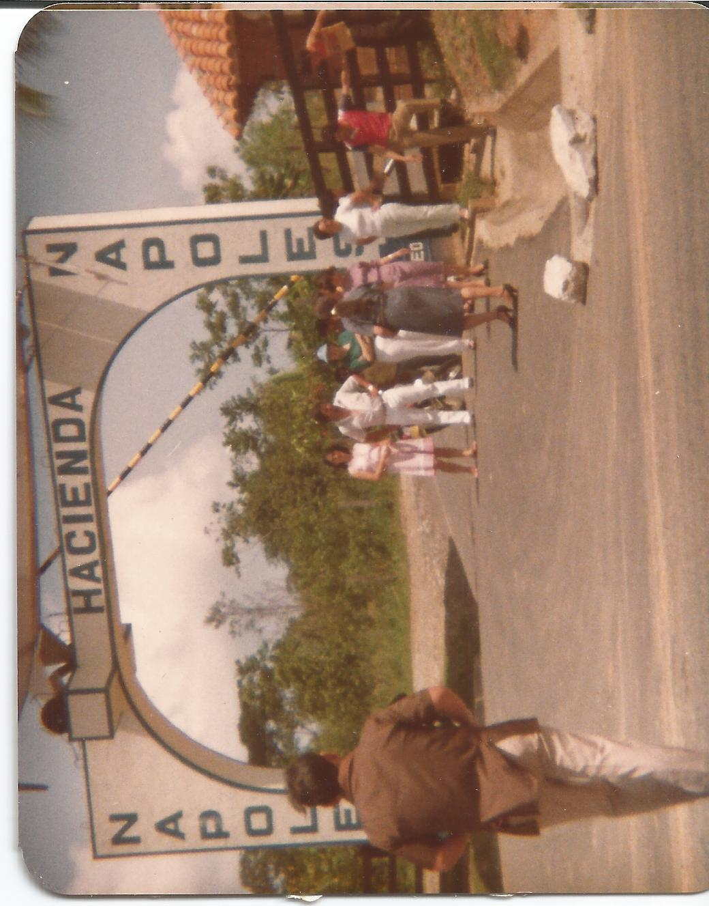
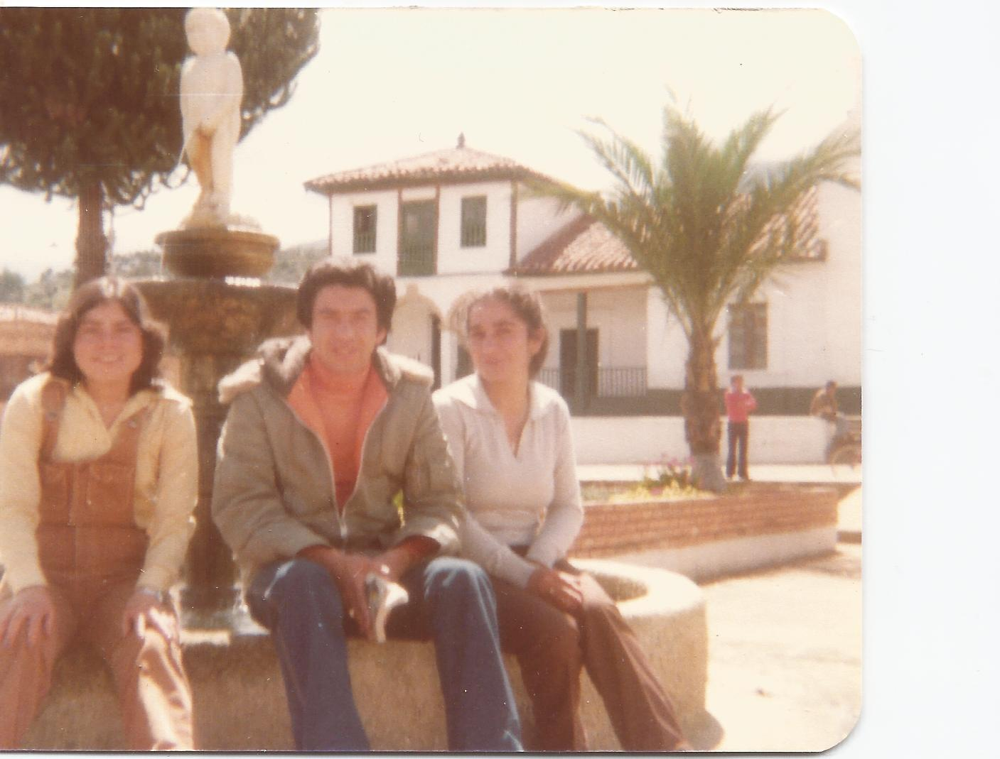
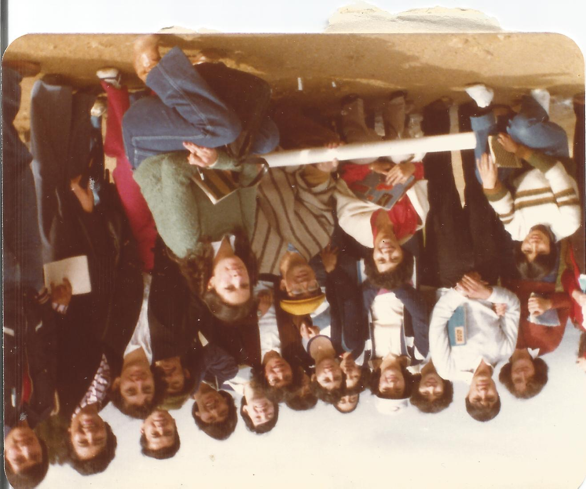

# crop_scanned_photos

Script that crops scanned photos

## Requirements

Needs the libraries 'getopt' and 'PIL'

## Usage

'''
python extract.py -i <input image>
'''

## Example

This is an example of multiple sanned images 

The output of the following command is
'''
python extract.py -i example/sample.jpg
'''

## Options:

* '-i'  Name of the input image
* '-f, --freq' Percentage of the pixels scanned. Default 0.05
* '--min_len' Subimages have a fraction of the original lenght . Default 100
* '--min_area' Subimages have a fraction of the original area . Default 0.1
* '--min_entropy' Subimages have a fraction of the original entropy . Default 0.8
* '--pos_x' Position in the x axis to find the height of the picture. Default 0.5
* '--pos_y' Position in the y axis to find the width of the picture. Default 0.5
* '--conf_lvl' Confidence level to distinguish an image from the background. Default 0.6

